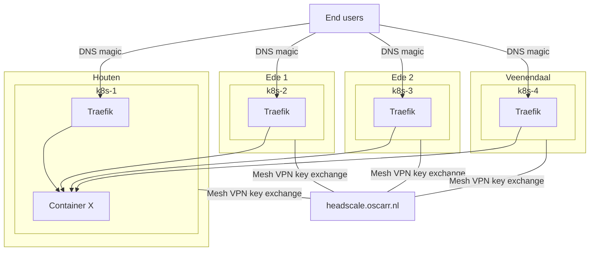

# Uber Kubernetes

## What is this?

This is the code repo where our friend group manages some shared infra.
What we define here is pushed to the cluster by [ArgoCD](https://argocd.lab.oscarr.nl/)

## Architecture

All the nodes are meshed together using [Wireguard](https://www.wireguard.com/),
[Tailscale](https://tailscale.com/kb/1151/what-is-tailscale/) and
[Headscale](https://headscale.net/).

This way the Kube-api and ETCD containers always have a stable way of reaching each other.

Internal load balancing of the Kube-api happens using a static pod running haproxy.

All the used DNS records point/CNAME to kubernetes.oscarr.nl

And the records under that subdomain are [automatically managed by a script](https://github.com/bierteam/kubernetes-dns)
that runs every 5 minutes as a Kubernetes cronjob.

Traefik runs as a DaemonSet on all locations and
internal Kubernetes networking is handled by [Cilium](https://cilium.io/).

## Connecting to the cluster

How to connect to the cluster is described [here](CONNECTING.md)
